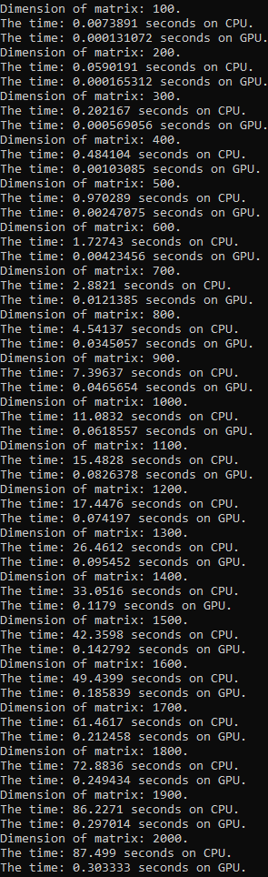
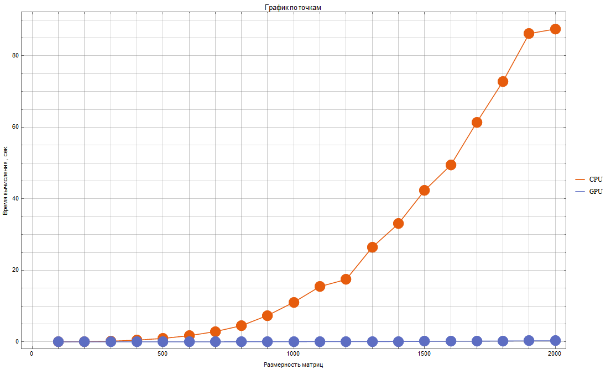
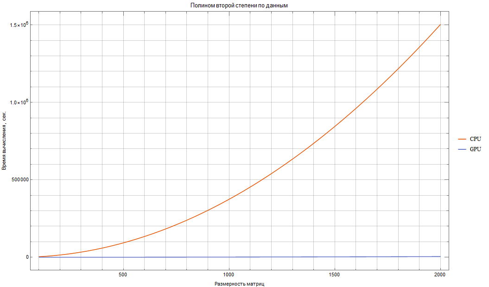

# Лабораторная работа 1: Перемножение матриц

Задача: реализовать алгоритм перемножения матриц
Язык: C++ или Python
Входные данные: 2 матрицы размером от 100х100 до 2000х2000 каждая.
Выходные данные: проверка корректности перемножения + время вычисления

Выбранный язык программироания для выполнения работы - C++. Была реализована программа, в которой выполнялось перемножение матриц, с автоматическим заполнением. С помощью библиотеки chrono фиксировалось выполнение операции перемножения матриц на CPU, а с помощью OpenMP была реализовано параллельное вычисление. На GPU 3 уровня вложенности на CPU были переделанны в 1, который выполнялся нитями или потоками

Результат работы программы:

Также был построен график в Wolfram Mathematica:

Был выполнен фит полиномом 2 третьей степени

По данным можно заметить, что GPU значительно быстрее в сравнении с CPU, даже с учетом времени расходуемого на пересылку информации из глобальной памяти на драйвер. Ускорение на матрицах размерности 2000x2000 достигает 288,5 раз (GPU в 288,5 раз быстрее CPU).