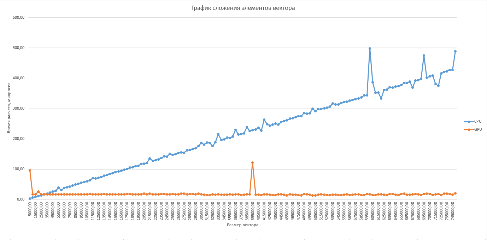

# Лабораторная работа 2: Сумма элементов вектора

Задача: реализовать алгоритм сложения элементов вектора
Язык: C++ или Python
Входные данные: Вектор размером 1 000..1 000 000 значений.
Выходные данные: сумма элементов вектора + время вычисления

Выбранный язык программироания для выполнения работы - C++. Была реализована программа, в которой выполнялось сложение элементов векторов, с заполнением цифрой 5. С помощью библиотеки chrono фиксировалось выполнение операции перемножения матриц на CPU, а с помощью OpenMP было реализовано параллельное вычисление. На GPU каждый поток обрабатывает часть элементов и потом все суммируется

Результат работы программы в виде графика в Excel:

График был построен по первым 150 вычислениям программы с шагом в 1000, так как если брать абсолютно все значения с этим шагом, то Excel не справляется быстро с данной задачей.

По данным можно заметить, что GPU значительно быстрее в сравнении с CPU, даже с учетом времени расходуемого на пересылку информации из глобальной памяти на драйвер, но также присутствуют некоторые выбросы значений, который также присутствуют на графике. Можно сделать вывод, что работу с векторами небольшого размера лучше выполнять на CPU. Ускорение для наибольшего размера вектора в 1000000 составило 52 раза (GPU в 52 раза быстрее CPU).
