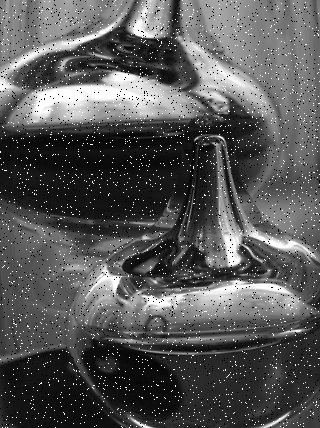

# Лабораторная работа 3: Salt-and-pepper noise filtering on GPU

Задача: реализовать фильтр для удаления шума Salt-and-pepper (Соль и перец).
Язык: C++.
Входные данные: изображение формата BMP с шумом.
Выходные данные: изображение формата BMP без шума.

Была реализована программа, в которой выполнялось удаление шума на CPU и GPU с изображения формата BMP. С помощью библиотеки chrono фиксировалось выполнение операции перемножения матриц на CPU, а с помощью OpenMP была реализовано параллельное вычисление. На GPU каждый поток обрабатывает пиксели изображения, в конечном итоге избавляясь от шума на изображении. Шум соли и перца, или чередование чёрных и белых частиц — одна из форм шума, которая как правило встречается на графических и видео изображениях. Этот фильтр работает в масштабе пикселей, просматривая окружающие соседние пиксели, указанные размером желаемого окна на изображении, сохраняя их в списке и выбирая срединное значение из этого списка. Это выбранное срединное значение теперь является новым значением пикселя для пикселя, с которым была произведена операция. Это довольно простой алгоритм, но есть пограничный случай. Граничные пиксели, у которых недостаточно соседних пикселей для удовлетворения требования размера окна, обычно обрезаются из изображения, тем самым немного уменьшая изображение в процессе.

Результат работы программы в виде следующих изображений:

, , 

По выходным данным можно заметить, что GPU значительно быстрее в сравнении с CPU, 0.0241994 секунд на CPU и 0.000758784 на GPU. Можно сделать вывод, что фильтрацию изображений лучше выполнять на GPU.