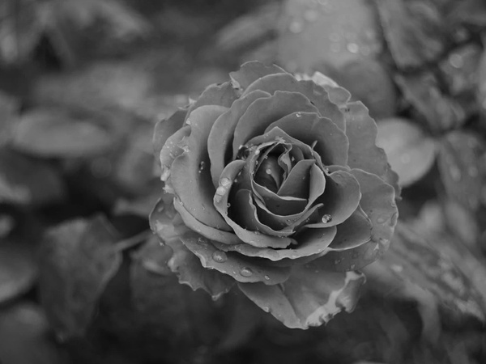

# Лабораторная работа 5: Bilateral filtering on GPU

Задача: реализовать фильтрацию изображения.
Язык: C++.
Входные данные: изображение формата BMP.
Выходные данные: изображение формата BMP после использования фильтра.

Была реализована программа, в которой выполнялось использование фильтра Гаусса на CPU и GPU с изображения формата BMP. С помощью библиотеки chrono фиксировалось выполнение операции перемножения матриц на CPU, а с помощью OpenMP была реализовано параллельное вычисление. На GPU каждый поток обрабатывает пиксели изображения, в конечном итоге применяя фильтр на изображение. Пропущенные значения в граничных строках и столбцах брались из ближайших пикселей. Также было принято решение реализовывать функции g и r отдельно, выполнены в варианте для CPU и GPU с модификатором device (вызывается из девайса и выполняется на девайсе)

Результат работы программы в виде следующих изображений:

, , 

езультаты вычислений визуально схожи. По выходным данным можно заметить, что GPU значительно быстрее в сравнении с CPU, 1.45866 секунд на CPU и 0.0137492  на GPU. Можно сделать вывод, что данную работу лучше выполнять на GPU с учетом значительного ускорения вычислений.